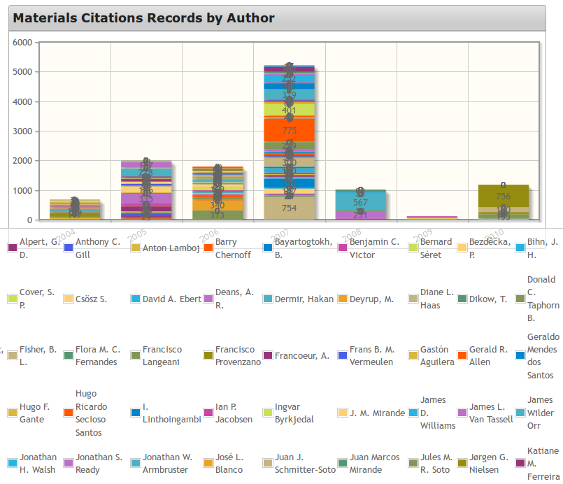
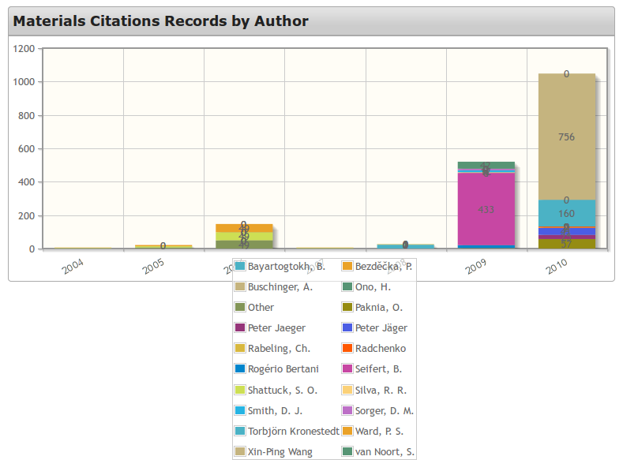

# GoldenGATE statistical queries #

This document provides notes on how to extract statistical information from GoldenGATE’s document repository. This query functionality was added to GoldenGATE during the [Data enrichment hackathon](http://wiki.pro-ibiosphere.eu/wiki/Hackathon_%22Pimp_my_Data%22,_March_17-21_2014) at Naturalis, Monday 17 March 2014 to Friday 21 March 2014.

The document concludes to show how the data can be visualised in a [data visualisation component](https://github.com/Dauvit/Data_enrichment/tree/master/data_visualisation) developed during the hackathon too.

This master version of this document resides <https://github.com/Dauvit/Data_enrichment/tree/master/data_visualisation>. 

----

## Available data and search terms ##


_Assembling statistics data queries as URLs._


A field name list is available in the following formats:
    - JSON: <http://plazi.cs.umb.edu/GgServer/srsStats/fields/json>
    - XML: <http://plazi.cs.umb.edu/GgServer/srsStats/fields/xml>
    - Text: <http://plazi.cs.umb.edu/GgServer/srsStats/fields/txt>

Use the fully qualified name, eg bib.author for an articles author, when building queries.


Define which fields go in the output:
```
    outputFields=<outFieldName1>+<outFieldName2>+...+<outFieldNameN>`
```


Define which fields to group the results by:
```
    groupingFields=<grpFieldName1>+<grpFieldName2>+...+<grpFieldNameN>
```


Define which fields to order the results by:
```
    orderingFields=<ordFieldName1>+<ordFieldName2>+...+<ordFieldNameN>
```


Restrict the results by the value of a specific field, eg bib.author or bib.year which have fixed values:
```  
    FP-<fieldName>=X (field value equals X)  
    FP-<fieldName>=X-Y (field value between X and Y, inclusive)  
    FP-<fieldName>=X- (field value equal to or larger than X)  
    FP-<fieldName>=-Y (field value less than or equal to Y)  
```


Specify a custom aggregate function for a field to use instead of default shown in field list:
```
    FA-<fieldName>=<aggregate>
```

Legal aggregate functions for all fields are `count`, `count-distinct`, `min`, `max`.

Additional legal aggregate functions for numbers only are `sum` and `avg`.


Restrict the results by the value of an aggregate field, eg maxCit.specimentCount which has a generated value:
```
    AP-<fieldName>=X (aggregate value equals X)
    AP-<fieldName>=X-Y (aggregate value between X and Y, inclusive)
    AP-<fieldName>=X- (aggregate value equal to or larger than X)-
    AP-<fieldName>=-Y (aggregate value less than or equal to Y)
```

You cannot use the same field to group and aggregate results in a query.


Set output format:
```
    format=<formatName>
```

Legal format names are `JSON`, `XML`, and `CSV`.


## Building queries ##


Using the fields listed above, a query URL looks like (broken down for readability, single line for actual use):
```
   http://plazi.cs.umb.edu/GgServer/srsStats/stats
   ?outputFields=<outFieldName1>+<outFieldName2>+...+<outFieldNameN>
   &groupingFields=<grpFieldName1>+<grpFieldName2>+...+<grpFieldNameN>
   &orderingFields=<ordFieldName1>+<ordFieldName2>+...+<ordFieldNameN>
   &FP-<fieldName1>=X&...&FP-<fieldNameN>=Z
   &FA-<fieldName1>=<aggregate1>&...&FA-<fieldNameN>=<aggregateN>
   &AP-<fieldName1>=X&...&AP-<fieldNameN>=Z
   &format=<format>
```

For text as well as values in your output ensure you specify the desired name in both `groupingFields` as well as `outputFields`. Otherwise you will simply retrieve the aggregate value for that field. See examples below.
 

## Examples ###


_If you re-run the sample queries below you might get different results because more articles will have been added to GoldenGATE since this documentation was prepared._

_Some of the query results shown below are truncated because the results sets are so large. You will see an ellipsis, …, as the last line in the sample results._

For example to retrieve author, year of publication and specimen count for each author, restricting the query to publication years in the range from 2004 to 2010 we can call:

<http://plazi.cs.umb.edu/GgServer/srsStats/stats?outputFields=bib.author+bib.year+matCit.specimenCount&FP-bib.year=2004-2010&format=json>

This will produce the not overly helpful statistics:

```
{"labels": {
"DocCount": "Number of Treatments",
"BibAuthor": "Document Author",
"BibYear": "Year of Publication",
"MatCitSpecimenCount": "Specimen Count (overall)"
},
"data": [
{
"DocCount": "15495",
"BibAuthor": "219",
"BibYear": "31095281",
"MatCitSpecimenCount": "15882"
}
]
}
```
----

However, if we add the extra grouping commands for author and year as in this query URL:

<http://plazi.cs.umb.edu/GgServer/srsStats/stats?outputFields=bib.author+bib.year+matCit.specimenCount&FP-bib.year=2004-2010&groupingFields=bib.author+bib.year&format=json>

We will see the author and year values.

```
{"labels": {
"DocCount": "Number of Treatments",
"BibAuthor": "Document Author",
"BibYear": "Year of Publication",
"MatCitSpecimenCount": "Specimen Count (overall)"
},
"data": [
{
"DocCount": "13",
"BibAuthor": "Maurice Kottelat",
"BibYear": "2004",
"MatCitSpecimenCount": "13"
},
{
"DocCount": "49",
"BibAuthor": "Paul H. Skelton",
"BibYear": "2007",
"MatCitSpecimenCount": "49"
},
{
"DocCount": "9",
"BibAuthor": "José L. Blanco",
"BibYear": "2006",
"MatCitSpecimenCount": "9"
},
{
"DocCount": "24",
"BibAuthor": "Gastón Aguilera",
"BibYear": "2005",
"MatCitSpecimenCount": "24"
},
{
"DocCount": "239",
"BibAuthor": "Michael W. Littmann",
"BibYear": "2007",
"MatCitSpecimenCount": "239"
},
{
"DocCount": "3",
"BibAuthor": "Ogata, K.",
"BibYear": "2007",
"MatCitSpecimenCount": "3"
},
…
```
----

Our next refinement is sort the results using `orderingFields`. This example sorts the results by year.

<http://plazi.cs.umb.edu/GgServer/srsStats/stats?outputFields=bib.author+bib.year+matCit.specimenCount&FP-bib.year=2004-2010&groupingFields=bib.author+bib.year&orderingFields=bib.year&format=json>


```
{"labels": {
"DocCount": "Number of Treatments",
"BibAuthor": "Document Author",
"BibYear": "Year of Publication",
"MatCitSpecimenCount": "Specimen Count (overall)"
},
"data": [
{
"DocCount": "34",
"BibAuthor": "Charles R. Haddad",
"BibYear": "2010",
"MatCitSpecimenCount": "36"
},
{
"DocCount": "8",
"BibAuthor": "Dikow, T.",
"BibYear": "2010",
"MatCitSpecimenCount": "8"
},
{
"DocCount": "6",
"BibAuthor": "Hamm, C. A.",
"BibYear": "2010",
"MatCitSpecimenCount": "6"
},
{
"DocCount": "1",
"BibAuthor": "Hawkes, P. G.",
"BibYear": "2010",
"MatCitSpecimenCount": "1"
},
{
"DocCount": "51",
"BibAuthor": "Jeremy A. Miller",
"BibYear": "2010",
"MatCitSpecimenCount": "133"
},
{
"DocCount": "6",
"BibAuthor": "Joanna Gardzinska",
"BibYear": "2010",
"MatCitSpecimenCount": "6"
},
{
"DocCount": "13",
"BibAuthor": "Miko, L.",
"BibYear": "2010",
"MatCitSpecimenCount": "13"
},
{
"DocCount": "57",
"BibAuthor": "Paknia, O.",
"BibYear": "2010",
"MatCitSpecimenCount": "57"
},
…
```
----

This example sorts the results by author.

<http://plazi.cs.umb.edu/GgServer/srsStats/stats?outputFields=bib.author+bib.year+matCit.specimenCount&FP-bib.year=2004-2010&groupingFields=bib.author+bib.year&orderingFields=bib.author&format=json>

```
{"labels": {
"DocCount": "DocCount",
"BibAuthor": "Author",
"BibYear": "Year",
"MatCitSpecimenCount": "SpecimenCount"
},
"data": [
{
"DocCount": "34",
"BibAuthor": "Charles R. Haddad",
"BibYear": "2010",
"MatCitSpecimenCount": "36"
},
{
"DocCount": "8",
"BibAuthor": "Dikow, T.",
"BibYear": "2010",
"MatCitSpecimenCount": "8"
},
{
"DocCount": "6",
"BibAuthor": "Hamm, C. A.",
"BibYear": "2010",
"MatCitSpecimenCount": "6"
},
{
"DocCount": "1",
"BibAuthor": "Hawkes, P. G.",
"BibYear": "2010",
"MatCitSpecimenCount": "1"
},
{
"DocCount": "51",
"BibAuthor": "Jeremy A. Miller",
"BibYear": "2010",
"MatCitSpecimenCount": "133"
},
{
"DocCount": "6",
"BibAuthor": "Joanna Gardzinska",
"BibYear": "2010",
"MatCitSpecimenCount": "6"
},
{
"DocCount": "13",
"BibAuthor": "Miko, L.",
"BibYear": "2010",
"MatCitSpecimenCount": "13"
},
{
"DocCount": "57",
"BibAuthor": "Paknia, O.",
"BibYear": "2010",
"MatCitSpecimenCount": "57"
},
{
"DocCount": "25",
"BibAuthor": "Peter Jaeger",
"BibYear": "2010",
"MatCitSpecimenCount": "25"
},
{
"DocCount": "23",
"BibAuthor": "Peter Jäger",
"BibYear": "2010",
"MatCitSpecimenCount": "41"
},
{
"DocCount": "2",
"BibAuthor": "Rabeling, Ch.",
"BibYear": "2010",
"MatCitSpecimenCount": "2"
},
…
```

This facilitates exploration and reconciliation of issues such as the authors appearing under several names, for example *Peter Jaeger* and *Peter Jäger* in the results shown above.

----

One potential problem with the data is simply that there can be too much of it. We have seen one use of `FP`, *fixed predicate*, already in our queries. This is how we restricted the range of years in the results by specifying `&FP-bib.year=2004-2010`. We can filter on any term with a fixed value, such as year, using `FP`.

To restrict a calculated value, we have to use `AP`, for *aggregated predicate*. In our example the material citations count is a calculated value. Hence to filter on this field we will have to use `AP` not `FP`. Therefore if we repeat the query above, but show only authors who have provided five or less specimen citations, we would add `&AP-matCit.specimenCount=-5` to the query.

<http://plazi.cs.umb.edu/GgServer/srsStats/stats?outputFields=bib.author+bib.year+matCit.specimenCount&FP-bib.year=2004-2010&groupingFields=bib.author+bib.year&orderingFields=bib.author&AP-matCit.specimenCount=-5&format=json>

```
<{"labels": {
"DocCount": "Number of Treatments",
"BibAuthor": "Document Author",
"BibYear": "Year of Publication",
"MatCitSpecimenCount": "Specimen Count (overall)"
},
"data": [
{
"DocCount": "2",
"BibAuthor": "Alec B. M. Moore",
"BibYear": "2007",
"MatCitSpecimenCount": "2"
},
{
"DocCount": "2",
"BibAuthor": "Anthony C. Gill",
"BibYear": "2006",
"MatCitSpecimenCount": "2"
},
{
"DocCount": "2",
"BibAuthor": "Benjamin C. Victor",
"BibYear": "2007",
"MatCitSpecimenCount": "2"
},
{
"DocCount": "4",
"BibAuthor": "Bernard Séret",
"BibYear": "2007",
"MatCitSpecimenCount": "4"
},
{
"DocCount": "2",
"BibAuthor": "Bezděčka, P.",
"BibYear": "2009",
"MatCitSpecimenCount": "2"
},
…
```
----

Perhaps it is more useful to restrict the query to authors who have contributed 20 or more specimen citations.

<http://plazi.cs.umb.edu/GgServer/srsStats/stats?outputFields=bib.author+bib.year+matCit.specimenCount&FP-bib.year=2004-2010&groupingFields=bib.author+bib.year&orderingFields=bib.author&AP-matCit.specimenCount=20-&format=json>

```
{"labels": {
"DocCount": "Number of Treatments",
"BibAuthor": "Document Author",
"BibYear": "Year of Publication",
"MatCitSpecimenCount": "Specimen Count (overall)"
},
"data": [
{
"DocCount": "23",
"BibAuthor": "Alexandre C. Ribeiro",
"BibYear": "2007",
"MatCitSpecimenCount": "23"
},
{
"DocCount": "754",
"BibAuthor": "Alexandre P. Marceniuk",
"BibYear": "2007",
"MatCitSpecimenCount": "754"
},
{
"DocCount": "24",
"BibAuthor": "Alexandre Scharcansky",
"BibYear": "2007",
"MatCitSpecimenCount": "24"
},
{
"DocCount": "313",
"BibAuthor": "Alfred W. Thomson",
"BibYear": "2006",
"MatCitSpecimenCount": "313"
},
{
"DocCount": "52",
"BibAuthor": "Anton Lamboj",
"BibYear": "2004",
"MatCitSpecimenCount": "52"
},
{
"DocCount": "26",
"BibAuthor": "Anton Lamboj",
"BibYear": "2005",
"MatCitSpecimenCount": "26"
},
{
"DocCount": "43",
"BibAuthor": "Barry Chernoff",
"BibYear": "2005",
"MatCitSpecimenCount": "43"
},
…
```

Having explored some of the possibilties on getting statistical data out of GoldenGATE, we will next consider how to view the data.

----

## Data visualisation in practice ##

The query results can be viewed in the data visualisation component, developed alongside the goldenGATE query component. 

 

The chart shows what happens when too much data is presented for visualisation. In this case, we are showing authors’ specimen contributions by year. However, the result is too overloaded to be readily comprehensible. A key part of data visualisation is understanding your data.

As we have seen it is possible to restrict the amount of data returned by a query. However, that approach to filtering data throws away the data that is not selected. Hence, if we select only the ten most prolific authors, we would lose sight of all the other authors.

The solution is to make use of the filtering we have provided in the data visualisation component.



In this chart there are only 20 entries shown: 19 individual authors with the remaining authors aggregated as *Other*.

This demonstrates that often, data visualisation has to be an interactive process in which you continually ask, *“So what? What is this data telling me?”*

----

## Conclusion ##

This document has introduced you to the queries available to extract statistical data from GoldenGATE. The output from these queries can be used in the data visualisation component to produce charts.

Final note, as might be expected with these two components being the product of a hackathon, even a generously week-long hackathon, they are capable of development and refinement.
